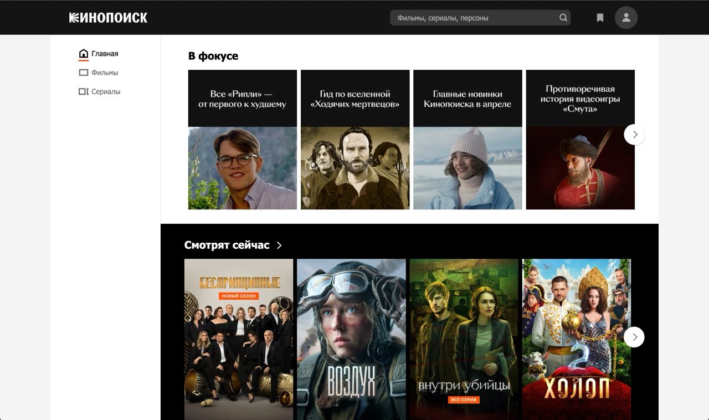

# Nfactorial Incubator task

## Оглавление

- [Введение](#введение)
- [Скриншот приложения](#скриншот)
- [Установка](#установка)
- [Использование](#использование)
- [Функционал](#функционал)
- [Зависимости](#зависимости)
- [Конфигурация](#конфигурация)

## Введение

Этот проект представляет собой веб-приложение, разработанное на базе фреймворка Laravel, которое предназначено для поиска и управления информацией о фильмах и сериалах. Приложение интегрировано с API Kinopoisk API Unofficial, что позволяет получать актуальные данные о кинопродукции.

В приложении реализованы функции регистрации и аутентификации, благодаря которым пользователи могут лично управлять подборками и добавлять фильмы в персональный список "смотреть позже". Особое внимание уделено адаптивности интерфейса: приложение оптимизировано для комфортной работы на мобильных устройствах, обеспечивая удобное взаимодействие в любых условиях.

## Скриншот



## Установка

Для установки и запуска проекта необходимо выполнить следующие шаги:

1. Клонировать репозиторий:

```sh
git clone https://github.com/Lazynx/nfactorial-kinopoisk.git
```

```sh
cd nfactorial-kinopoisk/
```

2. Установить зависимости Composer:

```sh
composer install
```

3. Настроить файл окружения `.env` для подключения к базе данных MariaDB и других сервисов. Зарегистрироваться на сайте: https://kinopoiskapiunofficial.tech/ для получения ключа API и указать его в `.env` файле.

```sh
cp .env.example .env
```

```sh
php artisan key:generate
```

(Для настройки MariaDB) укажите ваши данные от БД в `.env`:

```sh
DB_CONNECTION=mysql
DB_HOST=127.0.0.1
DB_PORT=3306
DB_DATABASE=ваше название БД
DB_USERNAME=ваш username
DB_PASSWORD=пароль от БД
```

4. Запустить миграции для создания структуры базы данных:

```sh
php artisan migrate
```

5. Запустить сервер разработки:

```sh
php artisan serve
```

## Использование

После установки и настройки приложение будет доступно по адресу `http://localhost:8000/main`. Для входа в систему или регистрации используйте соответствующие ссылки в интерфейсе пользователя.

## Функционал

- **Регистрация и аутентификация пользователей**: Позволяет пользователям регистрироваться и входить в систему для использования персональных функций.
- **Поиск по фильмам**: Пользователи могут искать фильмы по названию или другим параметрам.
- **Подборки фильмов и сериалов**: Предложены различные подборки, включая новинки и популярные фильмы.
- **Премьеры**: Отображение актуальных кинопремьер.
- **Добавление в "Смотреть позже"**: Пользователи могут добавлять фильмы в личный список для последующего просмотра.

## Зависимости

- PHP >= 8.3
- Laravel >= 11.0
- MariaDB или MySQL
- Composer
- Kinopoisk API Unofficial

## Конфигурация

Для настройки приложения необходимо правильно сконфигурировать файл `.env`, указав параметры подключения к базе данных и ключи API.

## Контакты

Если у вас есть вопросы или предложения по проекту, вы можете связаться со мной следующими способами:

- **Email**: [v_kudinov@kbtu.kz](mailto:v_kudinov@kbtu.kz)
- **LinkedIn**: [Kudinov Vladislav](https://www.linkedin.com/in/lazynx/)
- **Telegram**: [@lazynx](https://t.me/lazynx)
